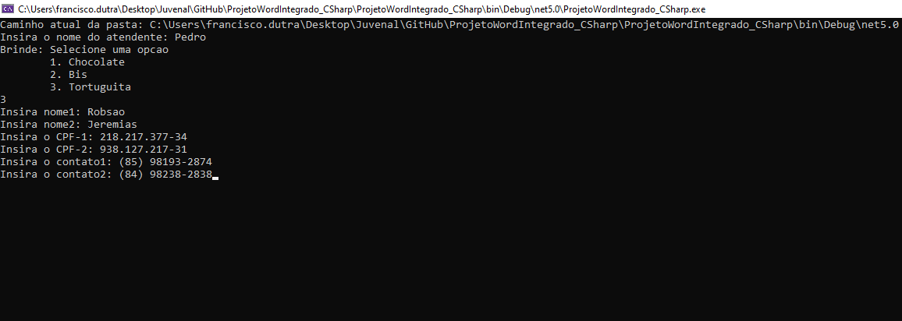
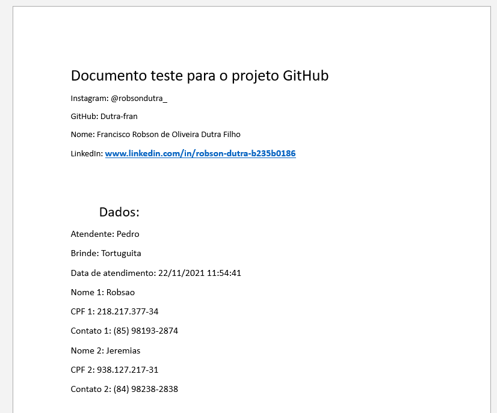

# Word document modifier

Criador: Francisco Robson de O. Dutra Filho 
Repositório criado no dia 22/11/2021 
Instagram: @robsondutra_  

<h2>Sobre</h2>
Aplicação, utilizando a linguagem C#, que modifica documentos do Word utilizando palavras chaves contidas no documento. IMPORTANTE, para que você tenha uma experiência importante dentro de nosso programa, saiba a maneira exata (maneira exata, digo, se baseando nela) da entrada que ele aceita: 
<ul>
  <li>Atendente: Robson</li>
  <li>Brinde: 2</li>
  <li>Nome1: Jubileu</li>
  <li>Nome2: Jeremias</li>
  <li>CPF 1: 487.128.374-34</li>
  <li>CPF 2: 089.732.134-10</li>
  <li>Contato 1: (85) 98136-9283</li>
  <li>Contato 2: (21) 94002-8922</li>
</ul>

  O restante das entradas acabam sendo mais intuitivas. Uma coisa que você deve levar bastante em conta é que o CPF tem que ser necessariamente no estilo: XXX.XXX.XXX-XX.

<h2>Requisitos:</h2>
Caso você queira reproduzir, ou até mesmo, por curiosidade, saber que tipo de libs eu utilizei, abaixo estará o nome dos pacotes nugets que utilizei nesse projeto:

<ul>
  <li>Microsoft.NETCore.App - Versão 5.0.0 (Isso é obrigatório ter instalado na máquina)</li>
  <li>DocX - Versão 1.8.0</li>
  <li>System.IO.Packaging - Versão 4.7.0</li>
</ul>

Você pode instalar o Microsoft.NETCore.App version 5.0.0 clicando <a href="https://dotnet.microsoft.com/download/dotnet/5.0">aqui</a>.

<h2>Funcionamento</h2>
Através de palavras-chave, eu consigo colocar dados informados dentro do programa num local exato que eu quiser.

<h2>Fotos Ilustrativas</h2>

